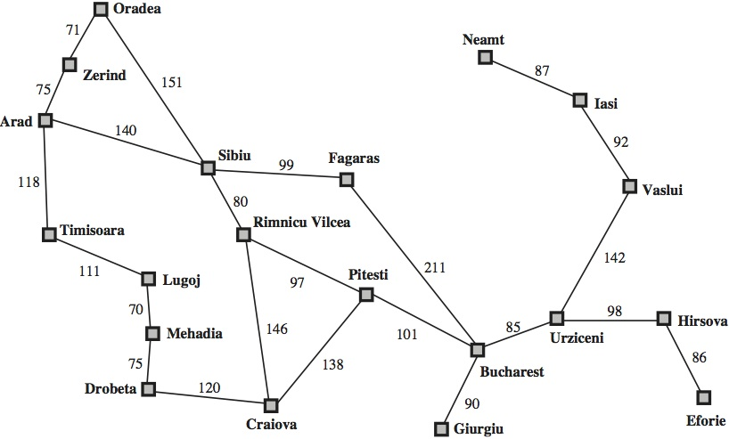

# Implementación de algoritmos de búsqueda.

A través de diferentes políticas de lista abierta (donde se almacenan los nodos expandidos pendientes de explorar) se implementan 3 diferentes algoritmos para recorrer un árbol de decisión, construido a medida que se expanden cada posibilidad. El "mapa" de Rumania donde se simula el recorrido es el siguiente:

### Búsqueda en profundidad

Al implementar la lista abierta como una pila (política LIFO, *Last-In, First-Out*), obligamos al algoritmo a siempre explorar el último nodo que acaba de introducir, por lo que al expandir uno, inmediatamente se explorará su hijo: obtenemos una búsqueda en profundidad.

En Python se implementa con una lista, cuyo método pop() extrae el último elemento de la misma.

### Búsqueda en anchura

En este caso, la lista será una cola (FIFO, *First-In, First-Out*), para hacer precisamente lo contrario, por lo que nunca profundizaremos sin haber explorado todos los nodos de un nivel.

En Python podemos establecer un puntero y redefinir el método pop(), para sacar siempre el primero que entró.

### Estrategia de ramificación y acotación

El algoritmo Branch & Bound consiste en utilizar, en este caso, la distancia acumulada que existe entre dos nodos como criterio para ordenar la lista abierta. Además, se incluye una lista cerrada donde almacenar las rutas más cortas ya exploradas. Por ello, se evita cualquier otra ruta entre dos nodos que sea mayor que una que ya esté registrada en la lista cerrada. Este algoritmo no es excesivamente costoso hablando de recursos y garantiza la solución óptima, al ser completo en cuanto a la exploración del árbol y obtener la ruta más corta.

En Python hay que ordenar la lista cada vez que se introduce un nodo. Lo hemos implementado utilizando la función sort() del lenguaje, ofreciéndole como criterio de ordenación el path_cost (coste de ruta).

### Estrategia de ramificación y acotación con subestimación

Exactamente igual a la anterior, exceptuando el criterio de ordenación. Le añadimos la heurística al coste de la ruta a la hora de ordenar la lista abierta. Dicha heurística se materializa como la distancia en línea recta entre los dos nodos del ábol. Con ello nos aseguramos que sea precisamente una heurística "subestimada": no existe una distancia menor a la línea recta. Por ello, el algoritmo también es óptimo, aunque más eficiente.

En Python se utiliza la misma implementación de lista abierta, añadiendo la heurística a la hora de ordenar la misma.

`Pablo De La Portilla Borrego`

`Fundamentos de los Sistemas Inteligentes, 2018-2019`

`Universidad de Las Palmas de Gran Canaria`